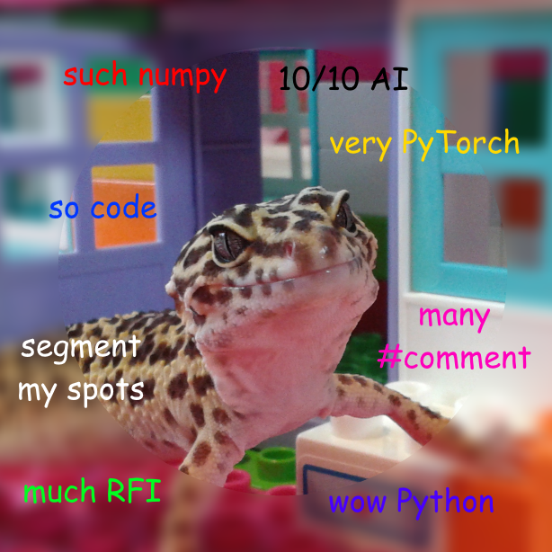

# LeopardGecko
This package contains tools for 3D semantic segmentation.

## segmentor.py
LeopardGecko segmentation is  powered by [volume-segmantics](https://github.com/rosalindfranklininstitute/volume-segmantics),
which makes training and predictions along multiple-axis, resulting in multiple predictions.
LeopardGecko collects these predictions and fuse them together
with a MLP classifier.

segmentor.py has training and routine functions, please see examples in the `scripts` folder.#

In addition, it can caclulate the Consistency Score of the predicted volume,
which is a sort of a volumetric heatmap of how consistent the multiple predictions were for each voxel.
and can be used as a metric that measures the certainty of the prediction.

[//]: # (TODO: Add more details of how to use)
 
## metrics.py
Some metrics functions from the predicted data

### AvgPool3D_LargeData()
Uses pytrorch to do a 3D average pooling, by providing parameters *data3d* (data volume),
*w_width* ( width in pixels of the cube chunk that is calculated in the GPU),
*k_width* (does the average in the cube with this width),
*s_stride* (step, in pixels for next average calculation).

This operation is normally done with the weighted predicted data to determine regions with higher consistency.

### Score data
Class to store and analyse score data. Contains routines to generate histograms and suggest volumes of interest based in histogram positions.

### Class PredictedData
Constructor (filename): initialise with a hdf5 containing the volume data that has been predicted and combined from several different orientations. This file is normally the output from the prediction produced by binary unet segmentation https://github.com/rosalindfranklininstitute/UnetSegmentation

## lg-genpredcsreport.py
Utility that can be used to generate a report of consistency score analysis from a combined prediction file. This script uses lg-genpredreport.ipynb notebook. Information about how to use and parameters to use can be obtained by running
`python lg-genpredcsreport.ipynb --help`

## (old) AvgPooling3DConsistencyData.ipynb
An average pooling operation using PyTorch CUDA routines are used. The data obtained gives a score about how consistent the data is in the each of smaller volumes.

## (old) AnalyseAvgPoolResults.ipynb
Data from the average pooling is analysed and consistency score based visualisations are available

